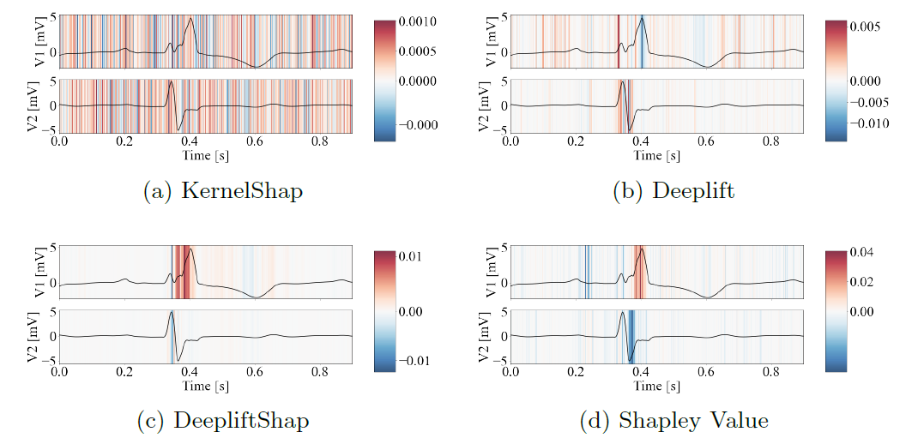

<div align="center">

# Evaluation of post-hoc interpretability methods in time-series classification
<a href="https://arxiv.org/abs/2202.05656"></a>
<a href="https://pdm.fming.de"></a>
<a href="https://github.com/hturbe/InterpretTime/blob/main/LICENSE"></a>
<!-- <a href="https://zenodo.org/badge/454440652.svg"></a> -->


</div>

This repository is the implementation code for :
[Evaluation of post-hoc interpretability methods in time-series classification]([http://arxiv.org/abs/2202.05656](https://www.nature.com/articles/s42256-023-00620-w)).

If you find this code or idea useful, please consider citing our work:

```
Turbé, H., Bjelogrlic, M., Lovis, C. et al. 
Evaluation of post-hoc interpretability methods in time-series classification. 
Nat Mach Intell 5, 250–260 (2023). https://doi.org/10.1038/s42256-023-00620-w
```

#### Table of Contents
* [Overview](#overview)
* [Data](#data)
  + [Datasets](#datasets)
  + [Trained Models](#trained-models)
  + [Paper's results](#papers-results)
* [Usage](#usage)
  + [Requirements](#requirements)
  + [Setup](#setup)
  + [Synthetic dataset creation](#synthetic-dataset-creation)
  + [Post-processing](#post-processing)
* [Example for synthetic dataset](#example-for-synthetic-dataset)
* [Example for ECG dataset](#example-for-ecg-dataset)

## Overview

This repository presents the framework used in the paper "Evaluation of post-hoc interpretability methods in time-series classification". The framework allows evaluating and ranking of interpretability methods' performance via the AUCSE metric;
for time series classification. As depicted in Fig.1, different interpretability methods can produce tangibly different results for the same model. It therefore becomes key to understand which intepretability method better reflect what the model learned and how the latter is using the input features. The paper also introduces a new synthetic dataset with tunable complexity that can be used to assess the performance of interpretability methods, and that is able to reproduce time-series classification tasks of arbitrary complexity.

<p align="center"></p>

**Fig.1**: Relevance produced by four post-hoc interpretability methods, obtained on a time-series classification task, where a Transformer neural network needs to identify the pathology of a patient from ECG data. Depicted in black are two signals, V1, and V2, while the contour map represents the relevance produced by the interpretability method. Red indicates positive relevance, while blue indicate negative relevance. The former marks portions of the time series that were deemed important by the interpretability method for the neural-network prediction. The latter marks portions of the time series that were going against the prediction.


## Data
Data associated with this repository as well as results presented in the article can be found on [Zenodo](https://zenodo.org/record/7534770#.Y8lkkXbMI2w) and are organised in 3 zip files. The folders should be unzipped and copied into `data/`.

```
data
├── datasets
├── trained_models
└── results_paper
```

### Datasets
Three datasets were used in the article:
- **ecg**: Processed version of the CPSC dataset from [Classification of 12-lead ECGs: the PhysioNet - Computing in Cardiology Challenge 2020](https://physionet.org/content/challenge-2020/1.0.2/)

- **fordA**: Dataset from the [UCR Time Series Classification Archive](https://cs.ucr.edu/~eamonn/time_series_data_2018/)

- **synthetic**: Synthetic dataset specifically developed for the purpose of the article

Each dataset is provided in Parquet format compatible with [Petastorm](https://github.com/uber/petastorm#petastorm) with each folder organised as follows:

```
Datasets
    ├── dataParquet
    ├── config__***.json
    ├── train.npy
    ├── val.npy
    └── test.npy
```
-  `dataParquet`: folder with the data formatted with Petastorm

-  `config__***.json`: configuration file used to process the data

-  `train.npy`: numpy array with the names of the samples used for the training set

-  `val.npy`: numpy array with the names of the samples used for the validation set

-  `test.npy`: numpy array with the names of the samples used for the test set

### Trained Models

Trained models are provided in the `trained_models` folder. A transformer, bi-lstm and CNN model are trained for three different datasets respectively called: *ecg*, *fordA* and *synthetic*. Each folder contains the following files:

```
Simulation
    ├── results
    ├── classes_encoder.npy
    ├── config__***.yaml
    ├── stats_scaler.csv
    └── best_model.ckpt
```

-  `results`: folder with the classification results of the simulation

-  `classes_encoder.npy`: class used for the encoder

-  `config__***.yaml`: config file with model's hyperparameters

-  `stats_scaler.csv`: Mean and median of the samples included in the training set (use to normalise the data)

-  `best_model.ckpt`: saved model

### Paper's results
The results obtained in the paper can be found in the `results_paper` folder. This folder includes the relevance obtained across the different models trained as well as the evaluation metrics. The results are organised as follows:

```
results_paper
    ├── model_interpretability
        └── simulation
             ├── interpretability_raw
             └── interpretability_results
    └── summary_results
```
-  `interpretability_raw`: include the relevance computed using the different interpretability methods for each sample which was included in the analysis

-  `interpretability_results`: include a summary of the different metrics for each interpretability metrics as well as a summary across the different methods included in `metrics_methods.csv`

## Usage
Setup tested with python 3.8.16 and Linux. Building the container described below and installing the python requirements can take up to 10 minutes the first time.

### Devcontainer
A configuration for a development container is provided in the `.devcontainer` folder. The current configuration assumes a CUDA-compatible gpu is available. In case gpus are not available, the following lines in `.devcontainer/devcontainer.json` should be commented
```json
    "hostRequirements": {
        "gpu": true
    },
    "features": {
        "ghcr.io/devcontainers/features/nvidia-cuda:1": {}
    },
    "runArgs": [
        "--gpus",
        "all"
    ],
```
### Requirements

The python packages are managed with PDM. If the project is not run using the .devcontainer provided, pdm should first be installed ([see instructions](https://pdm.fming.dev/latest/#installation)) before installing the packages with the following command:

```bash
pdm install
```

### Synthetic dataset creation
The synthetic dataset presented in the article can be recreated using the script in `src/operations/__exec_generate_data.py`. The command takes as input a `.yaml` file to configure the parameters used to generate the dataset. An example can be found in `environment/config_generate_synthetic.yaml`.

 e.g. from within src/operations:

```generate_synthetic
python3 __exec_generate_data.py --config_file ../../environment/config_generate_synthetic.yaml
```

A notebook to visualise the samples from the synthetic dataset is included in `/src/notebooks/visualise_sample.ipynb`.
### Post-processing

Relevance and metrics presented in the paper can be computed using the following command from within the src/operations folder:

```relevance
python3 __exec_postprocessing.py --results_path --method_relevance
```

-  `results_path`: path to the folder with the trained model

-  `sample_file`: name of the file stored in `src/assets/sample_post`. This file contains the name of the samples on which the relevance as well as the metrics are computed on.

-  `method_relevance`: list of interpretability method to be evaluated. Can be one (or a list) of [shapleyvalue, integrated_gradients, deeplift, gradshap, saliency, kernelshap]

Interpretability evaluation metrics are saved in `results/name_simulation`

## Example for synthetic dataset
From within src/operations:
```relevance
python3 __exec_postprocessing.py --model_path ../../data/trained_models/synthetic_cnn --sample_file sample_synthetic.npy
```

## Example for ECG dataset
From within src/operations:
```relevance
python3 __exec_postprocessing.py --model_path ../../data/trained_models/ecg_cnn --sample_file sample_ecg.npy
```

## Example for FordA dataset
From within src/operations:
```relevance
python3 __exec_postprocessing.py --model_path ../../data/trained_models/forda_cnn --sample_file sample_forda.npy
```
